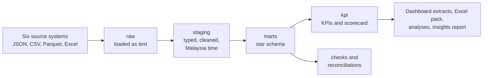

# Kelip Bank: Digital Banking BI

[](https://github.com/clarence1909/DigitalBankingBI_project/actions/workflows/ci.yml)

An end-to-end business intelligence project for Kelip Bank, a fictional Malaysian digital bank: six source systems, a SQL warehouse with a star schema, a KPI scorecard against plan, data quality checks and reconciliations that tie to the sen, five analyses with recommendations, a Tableau dashboard and a formula-driven Excel KPI pack. One command rebuilds all of it.

> **All data is synthetic.** Kelip Bank does not exist. Every customer, account and transaction is generated by a seeded Python simulator; nothing comes from a real bank or real customers.


The Executive page above is drawn by the pipeline from the same data as the Tableau dashboard. <!-- tableau-link: after publishing, replace this comment with [Open the interactive dashboard on Tableau Public](your link) -->

## Headline findings

<!-- findings:start -->

From the [insights report](reports/insights_report.md), which has five findings, each with a recommendation, an owner and a measure of success:

1. **TikTok is the cheapest channel per sign-up (RM17) but the most expensive per customer who stays (RM77).** TikTok brought in 5,288 customers at RM17 each, the lowest cost of any paid channel, but only 23% were still active in their third month, against 63% across all channels.
2. **The Raya FD promotion took the CASA ratio from 91% to 63% and pushed cost of funds to 2.60%.** Of RM12.5m placed in the promotion, 78% came out of customers' own Kelip savings, so most of it repriced existing money from about 2% to 3.88% rather than attracting new deposits.
3. **Loans approved under the loosened v2 policy were 3.4 times as likely to be 30+ days past due by month 6 (10.9% against 3.2%).** Arrears roll forward rather than cure: over the last six months 49% of loans 30 to 59 days past due were 60 to 90 days past due a month later and 65% of those went on to 90+, while only 26% cured.

<!-- findings:end -->

## Start here

| If you want to see | Open |
|---|---|
| The findings, recommendations and charts | [Insights report](reports/insights_report.md) |
| The monthly KPI pack in Excel | [kelip_bank_kpi_pack.xlsx](reports/kelip_bank_kpi_pack.xlsx) (download, then pick a month in the yellow cell) |
| What each KPI means, who owns it, and its target | [KPI dictionary](docs/05_kpi_dictionary.md) |
| Who needs what, and how each question is answered | [Business requirements](docs/01_business_requirements.md) |
| How it is built, and how it would run at a real bank | [Solution design](docs/03_solution_design.md) |
| Why it is built this way | [Decision log](docs/decisions.md) |
| Whether the numbers can be trusted | [Data quality report](reports/data_quality_report.md) |

## What the project covers

- **Bank:** Kelip Bank, a fictional Malaysian digital bank, with 24 months of data (September 2024 to August 2026)
- **Products:** savings accounts (CASA), fixed deposits including a Hari Raya promotion, a debit card and personal financing
- **Audiences:** the executive committee, growth and onboarding, product, treasury, cards, credit risk and finance
- **Sources:** six systems in four formats (JSON, CSV, Parquet and Excel), with the mess real extracts have: duplicate events, mixed time zones, inconsistent labels, a posting-code change, late card settlements and a hand-kept spreadsheet
- **Methods:** star schema modelling, a KPI catalog with a direction-aware red, amber and green scorecard, checks and reconciliations, cohort and channel economics, a Bayesian A/B test, vintage curves and roll rates, and k-means segmentation
- **Tools:** Python, DuckDB (SQL), Tableau Public, Excel (built with openpyxl) and GitHub Actions, all free

## How it works



`python run_pipeline.py` runs five stages: **generate** the source files, **load** them into DuckDB as text, **model** the staging, mart and KPI layers in SQL, **check** the data (errors stop the build), and **publish** the analyses, dashboard extracts, Excel pack and generated docs. It takes about 90 seconds. The [solution design](docs/03_solution_design.md) explains each layer.

## The numbers tie out

<!-- checks:start -->

- **26 data quality checks** on every build: 22 pass, 2 warn about problems planted in the marketing spreadsheet (a missing invoice and a typing error in its total), 2 report numbers for information, 0 fail ([report](reports/data_quality_report.md)).
- **Both reconciliations tie to the sen in all 24 months:** ledger postings to month-end balances, account by account, and the card processor's settlements to the ledger.
- **The Excel pack recalculates cleanly:** 827 formulas, 0 errors, and its values match the warehouse ([check](reports/excel_pack_check.md)).
- **Every error and warning check is proved to work** by breaking the data on purpose ([break-tests](reports/break_test_report.md)).
- **Two clean runs give identical files**, checked in CI on every push.

<!-- checks:end -->

## How to run it

You need Python 3.11 or newer and Git. LibreOffice is optional: if it is installed, the pipeline also recalculates the Excel pack and checks it against the warehouse.

1. Clone the repository:

   ```bash
   git clone https://github.com/clarence1909/DigitalBankingBI_project.git
   cd DigitalBankingBI_project
   ```

2. Create and activate a virtual environment:

   ```bash
   python3 -m venv .venv          # Windows: python -m venv .venv
   source .venv/bin/activate      # Windows: .venv\Scripts\activate
   ```

3. Install the pinned packages:

   ```bash
   pip install -r requirements.txt
   ```

4. Rebuild everything:

   ```bash
   python run_pipeline.py                  # everything, about 90 seconds
   python run_pipeline.py --from model     # reuse the generated data and rebuild from the SQL
   python run_pipeline.py --only check     # just the data quality checks
   python -m src.break_tests               # prove each check catches a deliberate break
   python -m src.benchmark                 # time the heaviest queries
   ```

## Project structure

| Path | What is in it |
|---|---|
| `run_pipeline.py` | One command: generate, load, model, check, publish |
| `data/reference/` | KPI catalog, monthly plan and lookup tables |
| `data/sample/` | A small sample of each source, to show the formats (the full files are rebuilt in `data/raw/`) |
| `sql/01_staging/` | One file per source table: cast, clean, de-duplicate, convert to Malaysia time |
| `sql/02_marts/` | The star schema: 5 dimensions and 7 facts |
| `sql/03_kpi/` | KPI tables by family, all KPIs by month, and the scorecard |
| `sql/tests/` | 25 data quality checks, including the two reconciliations |
| `sql/adhoc/` | Five stakeholder questions answered directly in SQL |
| `sql/schema.yml` | Every table and column described; a check fails if it drifts from the warehouse |
| `src/generate/` | The seeded simulator for the six source systems |
| `src/analysis/` | The five analyses behind the insights report |
| `src/export/` | Dashboard extracts, the Excel pack and its recalculation check, the Executive page picture |
| `dashboards/` | Tableau build notes and the CSV extracts |
| `reports/` | Insights report, charts, Excel KPI pack, and the check, break-test and benchmark reports |
| `docs/` | Requirements, data sources, solution design, dictionaries, ER diagram, user manual, glossary, decisions |
| `.github/workflows/ci.yml` | Rebuilds and checks everything on every push |

## Documentation

1. [Business requirements](docs/01_business_requirements.md): the bank, stakeholders, questions, requirements and traceability
2. [Data sources](docs/02_data_sources.md): the six sources and every cleaning rule
3. [Solution design](docs/03_solution_design.md): architecture, design choices, how it would run at a real bank
4. [Data dictionary](docs/04_data_dictionary.md) and [ER diagram](docs/er_diagram.md): every table and column (generated)
5. [KPI dictionary](docs/05_kpi_dictionary.md): the 22 KPIs (generated)
6. [Dashboard user manual](docs/06_dashboard_user_manual.md): for the people who read the dashboard
7. [Banking glossary](docs/07_banking_glossary.md): CASA, cost of funds, DPD, PAR30, GIL, vintages and more
8. [Decision log](docs/decisions.md): each design choice, why, and what else was considered
9. [Tableau build notes](dashboards/tableau_build_notes.md): how the dashboard is built, page by page

## Limitations

- **The data is simulated.** The five stories were planted on purpose, so the findings show that the methods work rather than facts about a real bank. Rates and events are anchored to real Malaysian ones where it matters, such as the OPR cut of July 2025.
- **Batch, monthly reporting.** There is no streaming or intraday data, no production credit-scoring model and no row-level security; the solution design says how a bank would add each one.
- **One machine.** DuckDB is ideal for one analyst and one pipeline; many concurrent users and billions of rows would need a server or cloud warehouse running the same SQL.
- **Short history.** Personal financing started in January 2025, so the newest vintages have only a few months on book, and measures that need time to observe leave out the latest cohorts.
- **The Tableau dashboard is built by hand** from the extracts, following the build notes, so it is refreshed by reopening it after a rebuild, not automatically.

## About

Built by Clarence Zhen Jin Tan as a portfolio project, with AI assistance (Claude) for code and documents. Every design choice is explained in the [decision log](docs/decisions.md).

## Licence

MIT. See [LICENSE](LICENSE).
