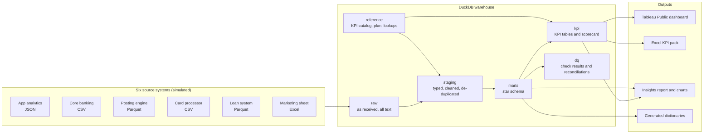

# Solution design

How the Kelip Bank BI project is built: the architecture, how data flows from six source systems to the dashboard and the Excel pack, the main design choices and why, and how the same design would run at a real bank.

> **All data is synthetic.** Kelip Bank is a fictional Malaysian digital bank; the source systems are simulated.

## Contents

1. [Architecture](#1-architecture)
2. [The pipeline](#2-the-pipeline)
3. [The warehouse](#3-the-warehouse)
4. [KPIs and the scorecard](#4-kpis-and-the-scorecard)
5. [Data quality](#5-data-quality)
6. [Outputs](#6-outputs)
7. [Key design choices](#7-key-design-choices)
8. [How it would run at a real bank](#8-how-it-would-run-at-a-real-bank)
9. [What is out of scope, and how a bank would add it](#9-what-is-out-of-scope-and-how-a-bank-would-add-it)
10. [Performance and scale](#10-performance-and-scale)

## 1. Architecture

Everything runs on one laptop or one CI runner with free tools: Python for generation, loading, orchestration, analysis and exports; DuckDB for the warehouse and all transformation, in SQL; Tableau Public for the dashboard; openpyxl for the Excel pack; GitHub Actions for CI.

## 2. The pipeline

One command, `python run_pipeline.py`, runs five stages in order. `--from <stage>` restarts part-way and `--only <stage>` runs one.

| Stage | What it does | Code | Time* |
|---|---|---|---:|
| generate | Simulates 24 months of the six source systems into `data/raw/`, from a fixed seed | `src/generate/` | 30 s |
| load | Copies every source into the `raw` schema as text, and logs row counts | `src/load.py` | 14 s |
| model | Runs the SQL files in `sql/01_staging`, `02_marts` and `03_kpi`, in file-name order | `src/model.py`, `sql/` | 25 s |
| check | Runs 25 SQL checks and the schema check, builds the reconciliation tables, runs the ad-hoc queries; stops on any error | `src/checks.py`, `sql/tests/`, `sql/adhoc/` | 4 s |
| publish | Analyses and charts, the Executive page picture, dashboard extracts, the Excel pack and its recalculation check, generated docs, the insights report | `src/publish.py` | 16 s |

\* On a 2-core cloud machine; about 90 seconds in all, well inside the five-minute target.

The pipeline is **deterministic**: the simulator is seeded, money is exact decimals, timestamps in files are fixed, and the Excel file's internal dates are pinned. Two runs on the same machine produce byte-identical outputs, and CI proves it on every push.

## 3. The warehouse

Six schemas, each with one job:

| Schema | Holds | Built by |
|---|---|---|
| `raw` | Each source exactly as it arrived, every column as text | `src/load.py` |
| `reference` | The KPI catalog, plan targets and lookup tables, from `data/reference/` | `src/load.py` |
| `staging` | One table per source table: typed, cleaned, de-duplicated, labels standardised, times in Malaysia time | `sql/01_staging/` |
| `marts` | The star schema: 5 dimensions and 7 facts | `sql/02_marts/` |
| `kpi` | KPI tables by family, all KPIs in long format, and the scorecard | `sql/03_kpi/` |
| `dq` | Check results and the monthly reconciliation tables | `src/checks.py` |

**The star schema** ([ER diagram](er_diagram.md), [data dictionary](04_data_dictionary.md)) uses the three classic kinds of fact table, each where it fits:

| Fact | Kind | Grain | Why this kind |
|---|---|---|---|
| `fct_ledger_postings`, `fct_card_authorisations` | Transaction | One row per posting or authorisation | Every movement of money, for any total at any grain |
| `fct_account_balances_monthly`, `fct_loan_status_monthly`, `fct_customer_monthly` | Periodic snapshot | One row per account, loan or customer per month end | Balances, arrears and activity are states at a point in time, not sums of events |
| `fct_onboarding_funnel` | Accumulating snapshot | One row per applicant, with a timestamp for each step | A process with fixed steps: each row is updated as the applicant moves on |
| `fct_marketing_spend` | Periodic | One row per sheet line per month | Spend as the marketing team reports it |

Dimensions: `dim_date`, `dim_channel`, `dim_product`, `dim_customer`, `dim_account`.

## 4. KPIs and the scorecard

- **The KPI catalog** ([`data/reference/kpi_catalog.csv`](../data/reference/kpi_catalog.csv)) is the single definition of each of the 22 KPIs: definition, formula, owner, unit, direction, amber band, target and SQL source. The [KPI dictionary](05_kpi_dictionary.md) is generated from it.
- **One SQL file per KPI family** (growth, engagement, cards, deposits, credit, finance) builds wide monthly tables for the dashboard pages.
- **`kpi.kpi_monthly`** stacks every KPI into one long table (month, KPI, value), which the scorecard, the Excel pack and the dashboard's trend charts all read. A check fails if any catalog KPI has no values.
- **`kpi.scorecard`** compares the six plan KPIs with `reference.plan_targets`: actual, prior month, plan, % of plan, variance, and a status that respects each KPI's direction and amber band. The status word (On plan, Watch, Off plan) and icon (▲ ● ▼) travel with the colour everywhere.

## 5. Data quality

Four layers of defence, all run automatically:

1. **Checks as SQL** ([`sql/tests/`](../sql/tests/)). Each file is a query that returns the rows that fail, with a header giving its name, severity and description. `error` stops the pipeline before anything is published; `warn` is reported; `info` reports numbers worth knowing. They cover unique keys, orphan records, funnel order, unmapped labels, balances, KPI ranges, arrears logic, catalog coverage and the marketing sheet.
2. **Two reconciliations that tie to the sen.** Every deposit account's month-end balance equals last month's plus the month's ledger postings (by Malaysia-time date), for every account in every month; and every settled card authorisation posts to the ledger once, for the same amount, on its settlement date.
3. **Break-tests** ([`src/break_tests.py`](../src/break_tests.py)). Each error and warning check is run on clean data, again after breaking the data on purpose inside a transaction, and again after rolling back. A check that does not fire when it should is itself a failure.
4. **Documentation checks.** `sql/schema.yml` must describe exactly the tables and columns in the warehouse, the Excel pack is recalculated in LibreOffice and compared with the warehouse, and every relative link in the docs must resolve.

## 6. Outputs

| Output | Built from | Notes |
|---|---|---|
| Dashboard extracts ([`dashboards/extracts/`](../dashboards/extracts/)) | `kpi`, `marts` | Tidy CSVs, one per dashboard need, that Tableau, Power BI or Qlik can read as they are |
| Tableau Public dashboard | The extracts | Built by hand following the [build notes](../dashboards/tableau_build_notes.md); five pages |
| Excel KPI pack ([`reports/kelip_bank_kpi_pack.xlsx`](../reports/kelip_bank_kpi_pack.xlsx)) | `kpi`, `reference` | 827 live formulas, a month and a KPI picker, conditional formatting, one chart, and a Checks sheet |
| Executive page picture | `kpi.scorecard` | The README's hero image, rebuilt each run |
| Five analyses and the insights report | `marts`, `kpi` | Each chart titled with its takeaway; each finding with a recommendation, owner and measure |
| Data dictionary, ER diagram, KPI dictionary | `schema.yml`, the catalog, the warehouse | Generated, so they cannot drift from the tables |

## 7. Key design choices

The full reasoning, with the alternatives considered, is in the [decision log](decisions.md). In short:

| Choice | Why |
|---|---|
| Simulate the bank, with planted stories | Real bank data is not available; planted stories with known answers prove the methods find them |
| DuckDB as the warehouse | Free, runs in-process, fast columnar SQL on millions of rows, one file, no server |
| Load everything as text first | A bad value can never break the load; every cleaning rule lives in SQL where it can be read and tested |
| Money as exact decimals, never floats | Totals tie to the sen and are identical on every run |
| Malaysia time applied in staging | Month-end cut-offs match the bank's books; reconciliation 1 fails if they do not |
| Checks return failing rows, graded by severity | A failure shows exactly which records are wrong; warnings do not block a month-end report |
| KPIs in one long table plus a catalog | One definition per KPI; the scorecard, dashboard and Excel pack read the same numbers |
| Direction-aware status with an amber band | "Worse than plan" means different things for deposits and for arrears |
| Tidy CSV extracts for the dashboard | Any BI tool can read them; Tableau Public cannot connect to a database anyway |
| Formula-driven Excel, checked in LibreOffice | The pack recalculates when the reader picks a month; the check proves it has no errors and matches SQL |
| Bayesian A/B test with rules set in advance | A direct probability that the new flow is better; a sample-ratio check and guardrail stop a misleading win |

## 8. How it would run at a real bank

The layers and the checks would stay the same; the tools around them would change to meet a bank's scale, controls and regulation.

| This project | At a bank |
|---|---|
| A simulator writes files | Nightly extracts and change data capture from core banking, the card processor and the loan system; app events streamed |
| One DuckDB file | A governed warehouse or lakehouse, on premises or in a cloud region that meets Bank Negara Malaysia's Risk Management in Technology (RMiT) policy and outsourcing rules |
| SQL files run in order by Python | dbt models with the same layers, scheduled by an orchestrator (Airflow, Dagster or Control-M), with lineage |
| `sql/tests/` and the break-tests | dbt tests or a data quality tool, with alerts to each data owner and a data quality dashboard |
| `data/reference/` CSVs | Governed reference data with owners and change control; the plan from the FP&A planning system |
| Tableau Public | Tableau Server or Cloud behind single sign-on, certified data sources, and row-level security |
| The Excel pack | The same pack published to a controlled SharePoint site, or scheduled PDF subscriptions |
| GitHub Actions | CI/CD with development, test and production environments, code review, change approval and segregation of duties |
| Monthly rebuild | Daily refresh for operational pages; official month-end figures only after Finance signs off the close |
| Synthetic data | Personal data under the PDPA 2010: classification, masking in non-production, access logging and retention rules |

## 9. What is out of scope, and how a bank would add it

- **Real customer data.** Sign data-sharing and access agreements, mask or tokenise personal data outside production, and test on masked copies. Nothing in the design depends on the data being simulated.
- **Real-time streaming.** Capture changes from core banking (for example with Debezium) into a stream (Kafka), and land them in the warehouse within minutes for operational pages such as fraud and onboarding. Keep monthly reporting on the reconciled batch layer, so official numbers still tie to the ledger.
- **A production credit-scoring model.** Build it under a model risk management framework: independent validation, monitoring of drift and performance, and fairness testing. The vintage curves and roll rates here are the monitoring such a model needs.
- **Row-level security.** An entitlement table mapping each user to what they may see (department, product, customer segment), applied as Tableau user filters or secure views in the warehouse, with access audited.

## 10. Performance and scale

The [benchmark](../reports/benchmark.md) (`python -m src.benchmark`) times the heaviest queries on the full warehouse: the account-by-account reconciliation over 3 million ledger postings takes about a quarter of a second, and dashboard reads take milliseconds. At ten times the data (30 million postings), the most expensive summary took about five seconds, twelve times as long as on the data as built: roughly linear.

What would change at a real bank's scale, in order:

1. **Build incrementally.** Only the new month needs building: snapshot and transaction facts are append-only by month, so each month's run touches a month of data instead of all history.
2. **Partition and cluster facts by month** (and by account for the ledger), so month-end and reconciliation queries read only what they need.
3. **Pre-aggregate for the dashboard.** The KPI layer already does this; the dashboard never queries transaction-level facts.
4. **Move to a warehouse built for many users.** DuckDB is ideal for one analyst or one pipeline run; hundreds of concurrent dashboard users and billions of rows need a server or cloud warehouse, with the same SQL.
