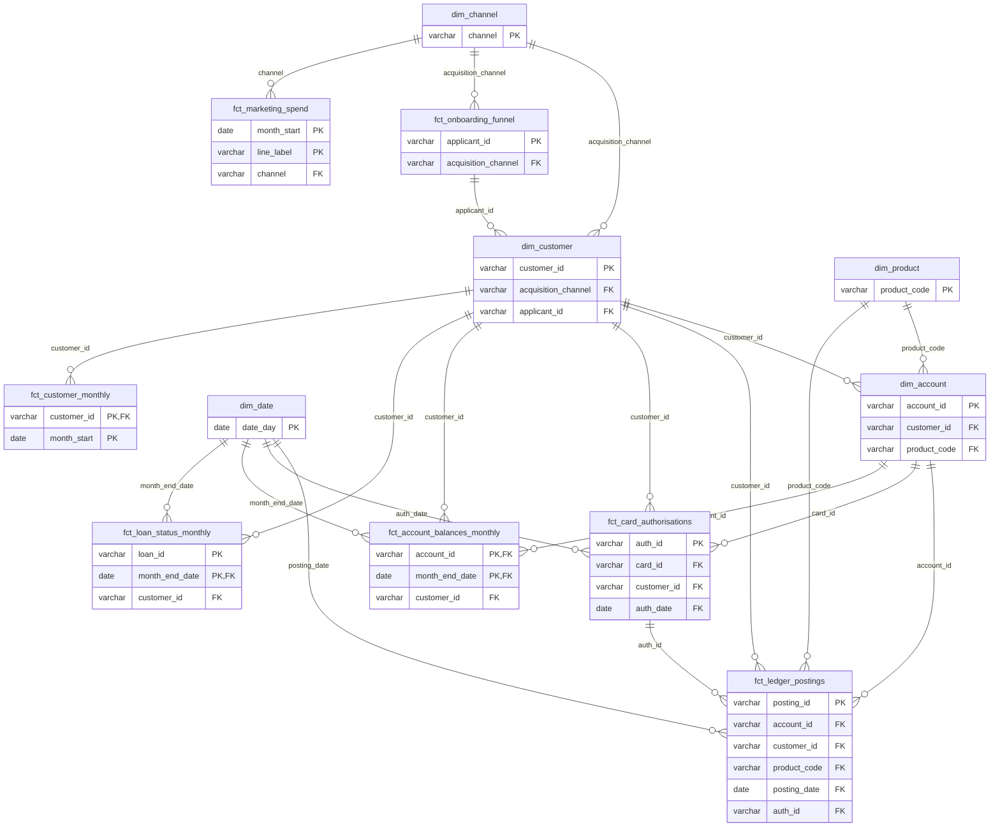

# ER diagram

<!-- Generated by src/docs.py from the relationships in sql/schema.yml. Edit the source and rerun the pipeline, not this file. -->

The star schema in the `marts` schema: dimensions (`dim_`) describe who and what, and facts (`fct_`) record what happened. Each box shows the table's keys; every column is listed in the [data dictionary](04_data_dictionary.md). Lines run from the table that is referenced (one) to the table that references it (many), labelled with the joining column. All data is synthetic.

## Table types

| Table | Type | Grain |
|---|---|---|
| `marts.dim_date` | Dimension | One row per day |
| `marts.dim_channel` | Dimension | One row per channel |
| `marts.dim_product` | Dimension | One row per product |
| `marts.dim_customer` | Dimension | One row per customer |
| `marts.dim_account` | Dimension | One row per account |
| `marts.fct_onboarding_funnel` | Fact: accumulating snapshot | One row per applicant |
| `marts.fct_ledger_postings` | Fact: transaction | One row per posting |
| `marts.fct_card_authorisations` | Fact: transaction | One row per authorisation |
| `marts.fct_account_balances_monthly` | Fact: periodic snapshot | One row per savings or fixed deposit account per month |
| `marts.fct_loan_status_monthly` | Fact: periodic snapshot | One row per loan per month on the books |
| `marts.fct_marketing_spend` | Fact: periodic (monthly spend by line) | One row per sheet line per month |
| `marts.fct_customer_monthly` | Fact: periodic snapshot | One row per customer per month while their account is open |
