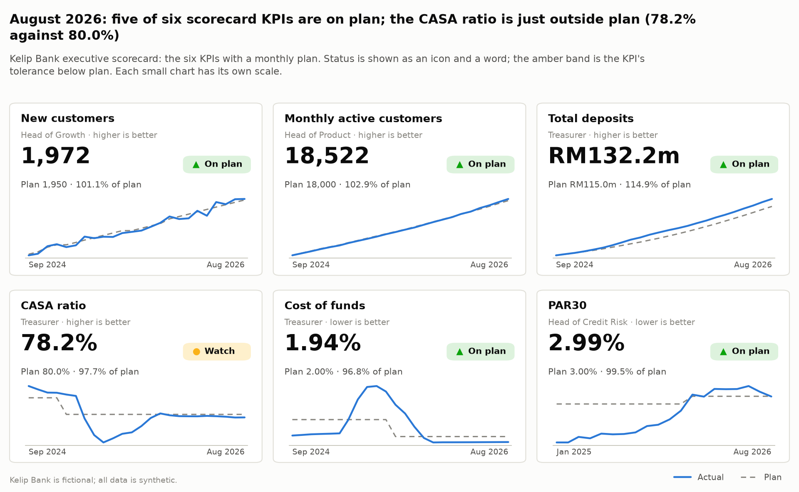
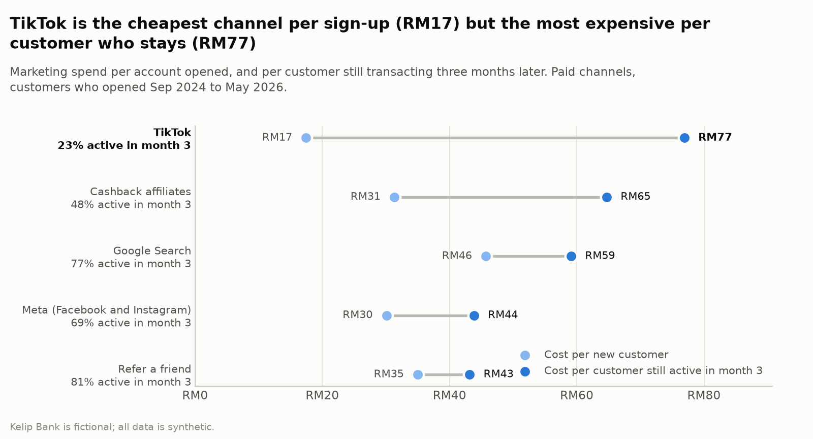
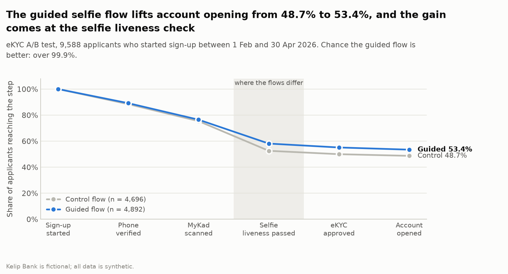
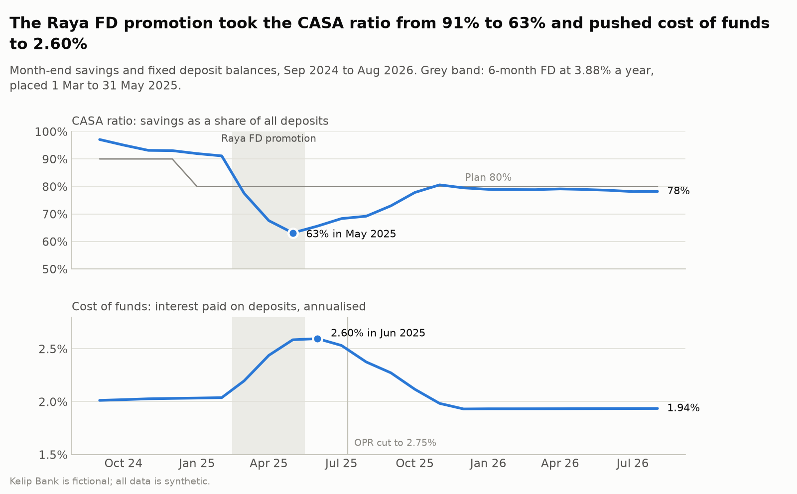
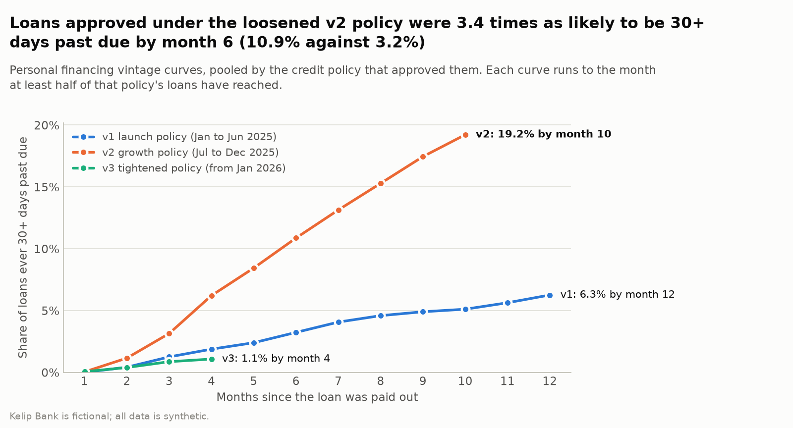
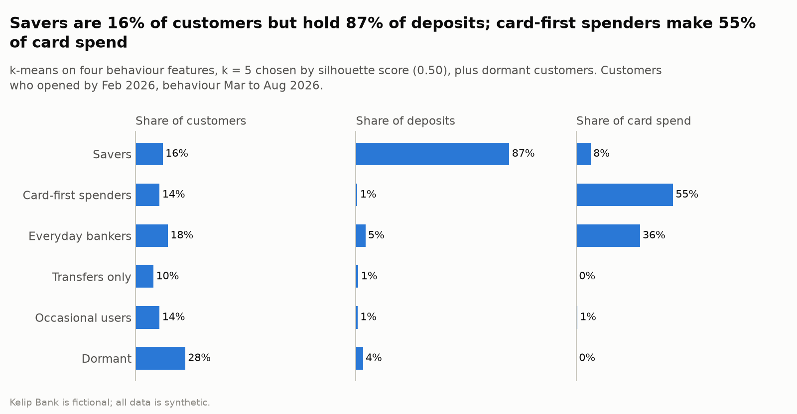

# Kelip Bank insights report, August 2026

<!-- Generated by src/report.py from reports/findings.json and the warehouse. Rerun the pipeline to update it. -->

> **All data is synthetic.** Kelip Bank is a fictional Malaysian digital bank. The simulator plants five stories with known answers, so these findings show the methods working, not facts about any real bank.

**Scorecard:** August 2026: five of six scorecard KPIs are on plan; the CASA ratio is just outside plan (78.2% against 80.0%).

## Summary

| # | Finding | Recommendation | Owner |
|---|---|---|---|
| 1 | TikTok is the cheapest channel per sign-up (RM17) but the most expensive per customer who stays (RM77) | Judge channels on the cost of a customer still active in month 3, not the cost of a sign-up, and show both side by side in the monthly pack. | Head of Growth, with the Head of Cards for card activation |
| 2 | The guided selfie flow lifts account opening from 48.7% to 53.4%, and the gain comes at the selfie liveness check | Keep the guided selfie flow for every applicant (it went live on 1 May 2026), and aim the next test at the same step, since the selfie liveness check is still where most applicants are lost. | Head of Onboarding |
| 3 | The Raya FD promotion took the CASA ratio from 91% to 63% and pushed cost of funds to 2.60% | Price the next promotion for new money only: pay the promotional rate on balances above what the customer already holds at Kelip, cap the campaign's size, and treat the CASA ratio's amber band as a stop-loss. | Treasurer |
| 4 | Loans approved under the loosened v2 policy were 3.4 times as likely to be 30+ days past due by month 6 (10.9% against 3.2%) | Keep the tightened v3 policy, and reopen grade D or debt service ratios above 45% only as a capped pilot with its own vintage tracking. | Head of Credit Risk |
| 5 | Savers are 16% of customers but hold 87% of deposits; card-first spenders make 55% of card spend | Run one play per segment, each with its own owner. | Head of Product, with the segment owners named above |

## 1. Acquisition: TikTok is the cheapest channel per sign-up (RM17) but the most expensive per customer who stays (RM77)

**Evidence**

- TikTok brought in 5,288 customers at RM17 each, the lowest cost of any paid channel, but only 23% were still active in their third month, against 63% across all channels.
- Per customer still active in month 3, TikTok cost RM77, 1.8 times as much as Refer a friend (RM43).
- Customers who activate their debit card within 30 days are far more likely to stay: 88% are active in month 3 against 65% of those who do not (same channels, so not just channel mix).

**Recommendation.** Judge channels on the cost of a customer still active in month 3, not the cost of a sign-up, and show both side by side in the monthly pack. Move budget from TikTok (RM77 per retained customer) towards Refer a friend (RM43) and Meta (RM44). Build card activation into every channel's first week: 88% of customers who activate their card within 30 days are still active in month 3, against 65% of those who do not.

**Owner.** Head of Growth, with the Head of Cards for card activation

**Measure of success.** Blended cost per month-3-active customer across paid channels falls from RM54 to RM43 within two quarters while new customers (K02) stay on plan, and card activation within 30 days (K10) rises from 58% towards its 65% target.

**How it was found.** Cohorts that opened from September 2024 to May 2026 (the last cohort with a third month in the data); paid channels only. Spend is the cleaned marketing sheet; a customer is active in month 3 if they made a transaction themselves in the third month after opening. Code and SQL: [`src/analysis/acquisition.py`](../src/analysis/acquisition.py), [`sql/03_kpi/01_kpi_growth.sql`](../sql/03_kpi/01_kpi_growth.sql), [`sql/adhoc/01_cost_per_retained_customer_by_channel.sql`](../sql/adhoc/01_cost_per_retained_customer_by_channel.sql).

## 2. Onboarding: The guided selfie flow lifts account opening from 48.7% to 53.4%, and the gain comes at the selfie liveness check

**Evidence**

- The biggest drop in sign-up is the selfie liveness check: before the test, only 70% of applicants who reached it got through.
- In the A/B test the guided flow raised account opening from 48.7% to 53.4% (+4.8 points, 95% credible interval +2.7 to +6.7); the chance it is better is over 99.9%. The 50/50 split held: the sample-ratio check gave p = 0.045, above the 0.001 threshold set in advance.
- The fraud guardrail held (0.83% of control accounts flagged against 0.65% guided; chance of a breach 0.3%), so the rule set before the test says ship the guided flow, as the bank did on 1 May 2026.

**Recommendation.** Keep the guided selfie flow for every applicant (it went live on 1 May 2026), and aim the next test at the same step, since the selfie liveness check is still where most applicants are lost. Reuse the rules that made this test trustworthy: a sample-ratio check before anything else, a fraud guardrail, and a decision rule written down before the results are read.

**Owner.** Head of Onboarding

**Measure of success.** eKYC completion (K04) stays at or above its 75% target (it was 77.4% in August 2026), onboarding conversion (K03) reaches 55% (now 53.8%), and the share of new accounts flagged for fraud within 30 days does not rise by more than half a point.

**How it was found.** Funnel steps from the app events. The A/B test is Bayesian: Beta(1, 1) priors and 200,000 draws from each posterior. The sample-ratio check (chi-square, p of at least 0.001), the fraud guardrail (flagged within 30 days, breached if the guided flow is worse by more than 0.5 points) and the decision rule were fixed in reference.experiments before the results were read. Code and SQL: [`src/analysis/onboarding.py`](../src/analysis/onboarding.py), [`data/reference/experiments.csv`](../data/reference/experiments.csv), [`sql/adhoc/05_onboarding_time_by_flow.sql`](../sql/adhoc/05_onboarding_time_by_flow.sql).

## 3. Deposits: The Raya FD promotion took the CASA ratio from 91% to 63% and pushed cost of funds to 2.60%

**Evidence**

- Of RM12.5m placed in the promotion, 78% came out of customers' own Kelip savings, so most of it repriced existing money from about 2% to 3.88% rather than attracting new deposits.
- The CASA ratio fell from 91% to 63% by May 2025 and cost of funds peaked at 2.60% in June 2025; the ratio only got back to 80% in November 2025.
- At maturity, 59% of promotion money was still with the bank 30 days later (35% rolled over), against 84% for standard fixed deposits.

**Recommendation.** Price the next promotion for new money only: pay the promotional rate on balances above what the customer already holds at Kelip, cap the campaign's size, and treat the CASA ratio's amber band as a stop-loss. Contact promotion customers two weeks before maturity with a rollover offer.

**Owner.** Treasurer

**Measure of success.** In the next promotion at least half of the money placed is new to Kelip (against 22% for Raya 2025), the CASA ratio (K14) stays within its amber band of the 80% plan, and at least 75% of promotion money is still with the bank 30 days after maturity (K16; Raya 2025 kept 59%).

**How it was found.** Month-end balances and ledger postings. Money counts as new to Kelip when it was transferred into the customer's savings in the three hours before the promotion placement; retention is measured 30 days after each deposit matured. Code and SQL: [`src/analysis/deposits.py`](../src/analysis/deposits.py), [`sql/03_kpi/04_kpi_deposits.sql`](../sql/03_kpi/04_kpi_deposits.sql), [`sql/adhoc/02_raya_promo_funding.sql`](../sql/adhoc/02_raya_promo_funding.sql).

## 4. Credit: Loans approved under the loosened v2 policy were 3.4 times as likely to be 30+ days past due by month 6 (10.9% against 3.2%)

**Evidence**

- By month 6 on book, 10.9% of loans approved under the v2 growth policy had been 30+ days past due, against 3.2% under v1 and 2.7% for the first two monthly vintages under the tightened v3.
- Arrears roll forward rather than cure: over the last six months 49% of loans 30 to 59 days past due were 60 to 90 days past due a month later and 65% of those went on to 90+, while only 26% cured.
- PAR30 peaked at 3.67% in June 2026 and has eased to 2.99% in August 2026 (just inside the 3.0% plan) as v2 loans season and fewer are approved; the GIL ratio (loans more than 90 days past due) has not turned yet: 1.26%, close to its June 2026 peak, because loans that fell behind earlier are still reaching 90 days.

**Recommendation.** Keep the tightened v3 policy, and reopen grade D or debt service ratios above 45% only as a capped pilot with its own vintage tracking. Add an early-warning trigger when a vintage's share of loans 30+ days past due runs above the v1 curve, and move collections effort to loans 30 to 59 days past due, where only 26% cure.

**Owner.** Head of Credit Risk

**Measure of success.** Early delinquency at month 6 (K21) stays below its 5% target for every v3 vintage, PAR30 (K19) stays at or below the 3.0% plan, and the cure rate from 30 to 59 days past due rises from 26% to 35%.

**How it was found.** Vintage curves pooled by the credit policy that approved each loan; each curve runs to the month at least half of that policy's loans have reached. Roll rates cover March to August 2026. Code and SQL: [`src/analysis/credit.py`](../src/analysis/credit.py), [`sql/03_kpi/05_kpi_credit.sql`](../sql/03_kpi/05_kpi_credit.sql), [`sql/adhoc/04_vintages_above_appetite.sql`](../sql/adhoc/04_vintages_above_appetite.sql).

## 5. Customer segments: Savers are 16% of customers but hold 87% of deposits; card-first spenders make 55% of card spend

**Evidence**

- k-means on four behaviour features, with k = 5 chosen by silhouette score (0.50), splits active customers into 5 segments; a further 28% of customers made no transactions of their own in six months.
- Deposits are concentrated: savers are 16% of customers and hold 87% of deposits (median balance RM18,560), so a few rate-sensitive customers drive the CASA ratio.
- Card-first spenders make 55% of card spend with a median balance of RM185, and everyday bankers, who mostly have their salary paid in, make 36%.

**Recommendation.** Run one play per segment, each with its own owner.

- **Savers** (16% of customers, 87% of deposits): Protect the relationship: tiered savings and FD ladders, and a retention offer before large deposits mature. Owner: Treasurer.
- **Card-first spenders** (14% of customers, 1% of deposits): Card rewards and instalment plans; they keep little in savings, so lend with care. Owner: Head of Cards.
- **Everyday bankers** (18% of customers, 5% of deposits): Win the salary: salary-crediting incentives, and the best audience for personal financing. Owner: Head of Product.
- **Transfers only** (10% of customers, 1% of deposits): Get the card into use: in-app activation nudges and first-purchase cashback. Owner: Head of Cards.
- **Occasional users** (14% of customers, 1% of deposits): Low-cost re-engagement: bill reminders and DuitNow QR prompts. Owner: Head of Product.
- **Dormant** (28% of customers, 4% of deposits): Win back only where it is cheap; stop paying bonuses to channels that produce them. Owner: Head of Growth.

**Owner.** Head of Product, with the segment owners named above

**Measure of success.** The dormant share of customers falls from 28% to below 20% within two quarters, the active customer rate (K08) rises from 60% towards its 65% target, and savers keep their 87% share of deposits through the next rate change.

**How it was found.** k-means on four behaviour features (average balance and card purchases, both logged, card share of spending, share of months active), standardised, with k from 2 to 8 chosen by silhouette score. Customers who opened by February 2026, behaviour from March to August 2026; customers with no transactions of their own are dormant by rule. Code and SQL: [`src/analysis/segments.py`](../src/analysis/segments.py), [`sql/02_marts/12_fct_customer_monthly.sql`](../sql/02_marts/12_fct_customer_monthly.sql), [`dashboards/extracts/customer_segments.csv`](../dashboards/extracts/customer_segments.csv).

## Limits of these findings

- The data is simulated. The stories were planted on purpose, so the value here is in the methods, which recover known answers, rather than in the numbers themselves.
- Channel costs come from a hand-kept spreadsheet. August 2026's Meta invoice is missing, so August has no cost per new customer, and the January 2026 total has a typing error the checks flag.
- Month-3 activity, fixed deposit retention and early delinquency need time to observe, so the latest cohorts drop out of those measures until their window closes.
- The segments describe behaviour, not value or profitability; a bank would add product holdings and revenue before targeting offers.

See also: [data quality report](data_quality_report.md), [Excel pack check](excel_pack_check.md), [KPI dictionary](../docs/05_kpi_dictionary.md).
